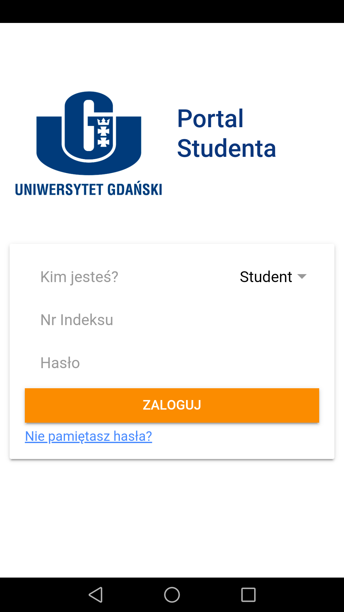
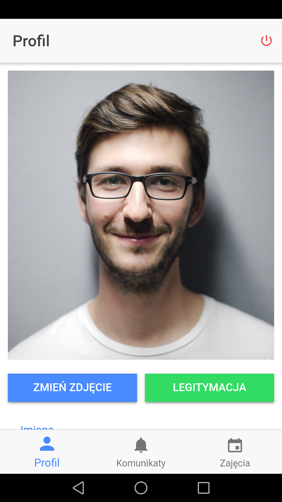
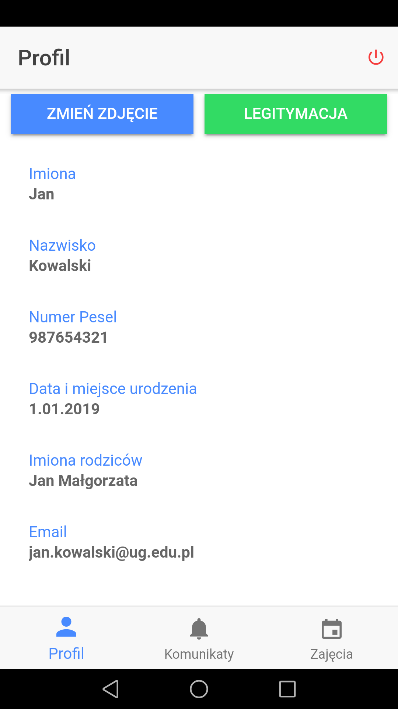
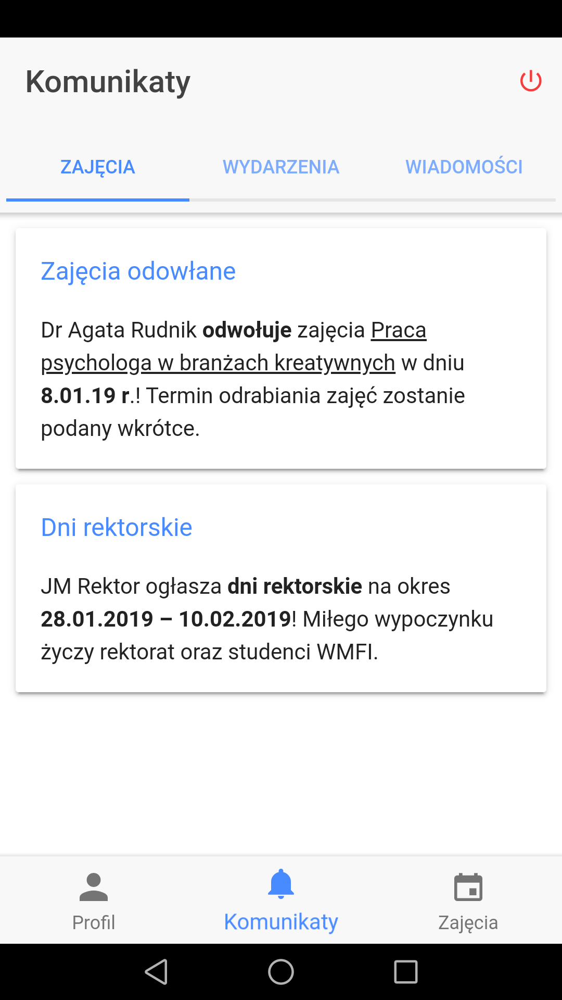
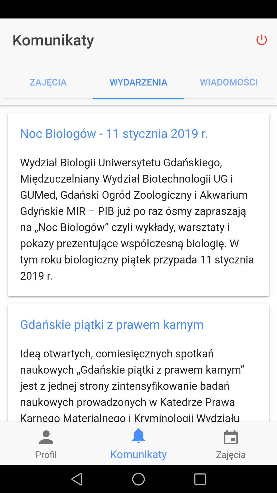
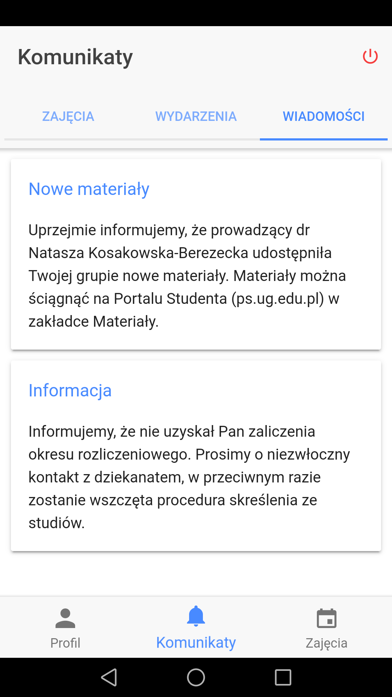

APP FOR LEGACY PURPOUSE ONLY — NO LONGER MAINTAINED

App was developed in January 2019 for the purpose of school project (back then I didn't know about the great wireframing tools like Adobe XD, so I just learned fundamentals of Anuglar in a week and then switched to Ionic 3 to build the prototype in the next one). It was connected with Firebase Console to send/receive notifications.

Some screenshots from the working build:

